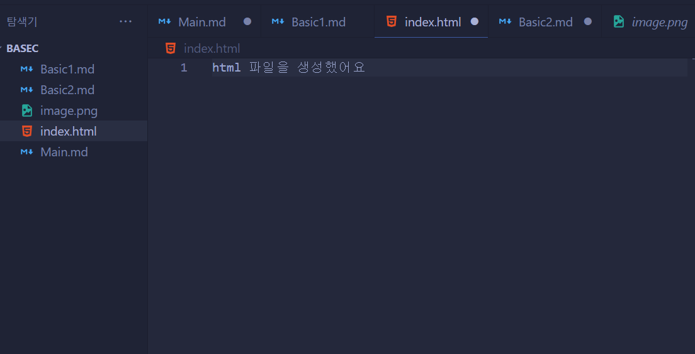

## 1장 html이란 무엇인가

* html은 HyperText Markup Language를 의미합니다.

**HyperText** : 하이퍼링크를 통해 어떤 문서에서 다른 문서로 접근 가능한 텍스트 입니다.
**Markup** : 콘텐츠를 표시합니다.
**Language** : 언어

* 즉 하이퍼 텍스트와 콘텐츠를 표시해주는 언어입니다!.

* 쉽게 말해, html은 웹브라우저를 통해 표시되는 웹페이지의 콘텐츠를 정의하기 위해 사용하는 언어입니다.

* 웹 페이지의 콘텐츠를 정의하기 위해 사용하는게 html입니다. 개발자는 html코드로 웹 페이지에 어떤 내용이 표시될 지를 정의한 html 문서를 만듭니다.

* 완성된 html코드를 웹브라우저에서 로딩하면 웹페이지가 만들어지게 됩니다. html코드가 웹 브라우저를 통해 해석 및 표현되는 과정을 렌더링이라고 합니다.

* html 문서는 파일의 확장자가 html또는 htm입니다.

* index.html 파일을 수정하고 싶다면 텍스트 편집기로 열어야 하며, 결과를 확인하고 싶다면 웹 브라우저로 열어야 합니다. 여기서 vs code가 대표적인 텍스트 편집기 입니다. 웹 브라우저는 크롬, 파이어폭스, 사파리, 인터넷 익스플로러 엣지 등등이 있습니다.

---

### html 실습하기 

* 메모장이나 텍스트 에디터로 저장을 하는데, 확장자를 html로 저장하는 방식이 있고, vs code로 html 파일을 만들어서 라이브 서버 익스텐션을 돌릴 수 있습니다.

---

### 내용 정리하기

* html은 웹페이지의 콘텐츠를 정의하는 문서 또는 문서 작성 양식입니다.

* html 코드는 html 파일에 작성합니다. 여기서 확장자는 html 또는 htm이어야 합니다.

* 텍스트 에디터에서 작성한 html 코드는 웹 브라우저를 통해 표시할 수 있습니다.