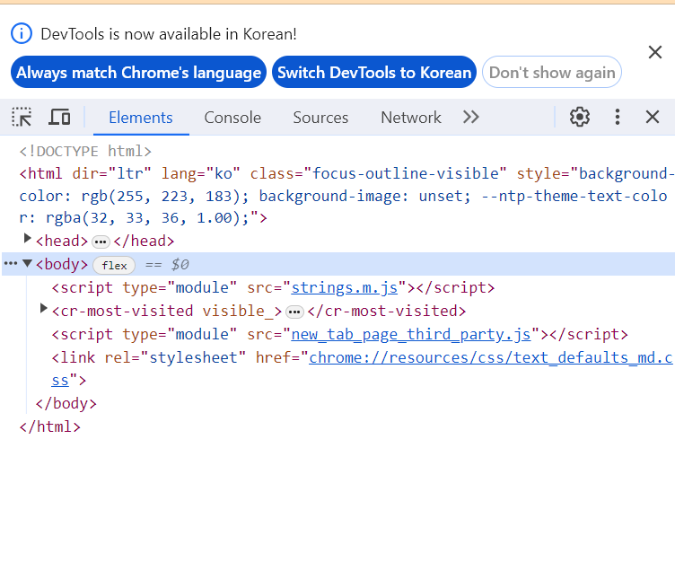

## 2장 개발자 도구와 코드 에디터

* 웹 브라우저에는 개발자 도구가 탑재되어 있습니다. 웹사이트에서 f12 버튼을 누르면 볼 수 있습니다.

---

### 개발자 도구란?

* 웹 사이트 개발용 도구로, 대부분의 최신 브라우저에는 개발자 도구가 탑재되어 있습니다. html,css코드 확인, 모바일 모니터링, 네트워크 상태 점검, 스크립트 명령어 확인 등등 다양한 기능을 통해 개발자에게 편의를 제공합니다.

* html 학습을 위해서는 일부 기능만 사용하면 되기에 부담 가질 필요는 없습니다.

* 네이버 사이트를 예시로 들어보면 네이버 사이트를 연 상태에서 개발자 도구를 열 경우, 네이버 홈페이지의 html 코드를 확인할 수 있습니다.

* 우리가 직접 html 코드를 작성할 경우에도 이러한 기능을 제공받을 수 있습니다.

--

### 코드 에디터

* 코드 에디터는 프로그래머가 프로그램 소스 코드를 편집하기 위해 사용하는 소프트웨어 입니다.

* 코드는 결국 텍스트입니다. 그러나 이 텍스트를 더 빠르게, 더 편하게 작성하기 위해서는 코드 에디터를 사용하는 것이 좋습니다.

* 텍스트 자동 완성 기능과 하이라이팅 기능이 추가된 업그레이드 메모장이라 생각하면 편합니다.

* vs code가 오픈소스 프로그램 및 성능 좋은 코드 에디터로써 사용을 추천합니다.

---

### 내용 정리하기

* 대부분의 최신 브라우저에는 개발자 도구가 탑재되어 있습니다.

* 개발자 도구는 개발자의 웹 개발 속도 및 편의를 증가시킵니다.

* 개발자는 코드를 더 빠르고 편하게 편집하기 위해 코드 에디터를 사용합니다.