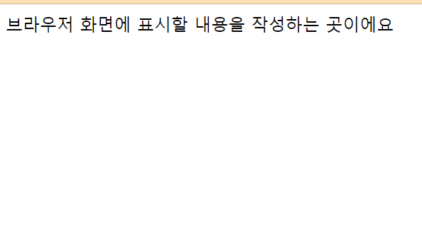

## 4장 HTML 문서의 기본 구조



* HTML 문서의 기본 구조는 다음과 같습니다.
```javascript
<!DOCTYPE html>
<html lang="en">
<head>
    <meta charset="UTF-8">
    <meta name="viewport" content="width=device-width, initial-scale=1.0">
    <title>문서의 제목을 쓰는 곳이에요</title>
</head>
<body>
    브라우저 화면에 표시할 내용을 작성하는 곳이에요
</body>
</html>
```

### !DOCTYPE html

* 문서의 첫 부분에서 문서 유형을 지정하는 단일 태그입니다.

* 이때 문서 유형이란 웹 브라우저에게 '이 문서는 00니까 잘 처리해줘' 라는 메세지를 전달하는 것입니다.

* HTML은 첫 등장 후에 시간이 지나면서 버전 변경을 해왔는데, 현재 표준으로 사용되고 있는 HTML 버전을 사용하기 위해 적어주는 타입이 바로 'html'입니다.

* 특별한 경우가 아니라면 이전에 사용하던 HTML 버전에 대해서는 몰라도 괜찮습니다. 

---

### html 태그

* 문서 유형을 지정한 후 실제 문서가 시작되고 끝나는 것을 나타내는 태그입니다.

* html 태그로부터 HTML 문서가 시작되고 닫는 html태그로 HTML문서가 끝나게 됩니다.

* 이 태그의 내부에 다양한 태그들이 포함되어 문서의 내용을 구성하는 것이죠.

---

### head 태그

* 웹 브라우저 화면에는 보이지 않지만 웹 브라우저가 알아야 할 정보들은 모두 head 태그에 들어갑니다.

* meta charset ="utf-8" : 문자 인코딩 및 문서 키워드 등에 대한 요약 정보를 기입하는 단일 태그입니다. 여기서 문자 인코딩이란 한글을 표시하기 위해 문자 세틀르 지정하는 작업으로 영문과 한글을 모두 사용하기 위해 utf-8 방식을 사용하는 것이 좋습니다.

* title : 문서의 제목을 나타냅니다. 콘텐츠를 브라우저 탭에 표시됩니다.

---

### body 태그

* 실제로 브라우저 화면에 표시될 내용을 입력하는 태그입니다. 여기에는 다음과 같은 유형의 태그들이 포함될 수 있습니다.

* 텍스트를 표시하는 태그
* 이미지를 표시하는 태그
* 각종 사용자 인터페이스(버튼, 입력란, 드롭다운 메뉴 등등)를 나타내는 태그

* 기본 문서 구조를 통해 확인했듯이, 태그 안에 태그를 포함하는 방식으로 콘텐츠를 다양하게 구상할 수 있습니다.

---

### 내용 정리

* HTML 코드를 작성할 경우에는 기본 문서 구조를 마련한 다음 작성합니다.

* 들여쓰기를 통해 태그 간의 포함 관계를 나타냅니다. 이는 가독성에 도움이 되는 요소이며, 문법적으로 필수 사항은 아닙니다.

* head 태그에는 문서의 정보가, body 태그에는 표시할 내용이 포함됩니다.

* 태그의 콘텐츠로 또 다른 태그가 포함될 수 있습니다.