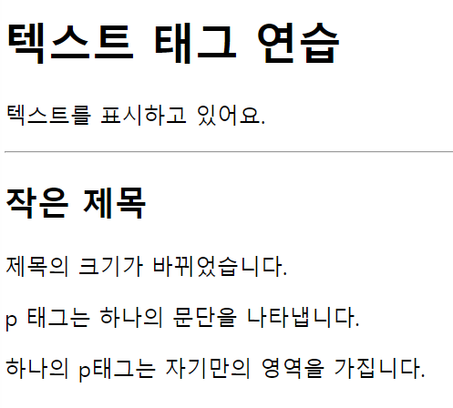

## 5장 텍스트 태그 사용 방법과 특징



### 문단 (paragraph)

* p 태그는 문단 요소를 나타내는 태그로써, 가장 많이 사용되는 텍스트 태그, 하나의 p 태그는 하나의 문단을 표현합니다. 문단과 문단 사이에는 공백이 있습니다.

```javascript
<p>안녕하세요! 이것은 문단을 표시하는 태그입니다.</p>
<p>문단과 문단 사이에는 공백이 있습니다. 이 문단의 위쪽을 보시면 확인이 가능합니다.</p>
```

---

### 제목 (headline)

* h 태그는 제목 요소를 나타내는 태그입니다. 숫자와 함께 사용되며, 1일 때 가장 크고 6일 경우 가장 작습니다.

```javascript
<h1>가장 큰 제목!</h1>
<h2>두 번째로 큰 제목!</h2>
<h3>세 번째로 큰 제목!</h3>
<h4>네 번째로 큰 제목!</h4>
<h5>다섯 번째로 큰 제목!</h5>
<h6>가장 작은 제목!</h6>
```

---

### 수평선

* hr 태그는 수평선을 표시하는 태그입니다. 수평선은 주제 변경 또는 내용 구분을 위해 주로 사용됩니다.

```javascript
<p> 지금까지 스포츠 뉴스였습니다. </p>
<hr />
<p> 날씨입니다. 춥습니다. </p>
```

---

### 실습하기

```javascript
<!DOCTYPE html>
<html lang="en">
<head>
    <meta charset="UTF-8">
    <meta name="viewport" content="width=device-width, initial-scale=1.0">
    <title>텍스트 태그 연습하기</title>
</head>
<body>
    <h1>택스트 태그 연습</h1>
    <p>텍스트를 표시하고 있어요.</p>
    <hr />
    <h2>작은 제목</h2>
    <p>제목의 크기가 바뀌었습니다.</p>
    <p>p 태그는 하나의 문단을 나타냅니다.</p>
    <p>하나의 p태그는 자기만의 영역을 가집니다.</p>
</body>
</html>
```

---

### HTML 텍스트의 특징

* 일반적으로 엔터는 줄바꿈을 의미하는 입력이지만, HTML 코드에서는 이를 무시합니다. 또한 스페이스를 통한 공백도 한 번씩 밖에 인정되지 않습니다.

* **줄바꿈 태그와 공백 문자** : HTML br 태그가 줄 바꿈을 의미합니다. 공백을 두 번 이상 표시하고자 할 경우에는 &nbsp를 사용합니다.

```javascript
    <p>공&nbsp;&nbsp;백 <br/> 그리고 줄바꿈 </p>
```

---

### 내용 정리

* p 태그는 문단을 표시하는 태그입니다.
* h1 ~ h6 태그는 헤드라인을 표시하는 태그이며, 숫자가 작을 수록 큽니다.
* 수평선 hr은 주제 변경이나 내용 구분 시에 사용하는 태그입니다.
* HTML은 텍스트의 줄바꿈, 공백 등을 엔터와 스페이스로 처리하지 않으며, 스페이스는 한 번씩만 허용됩니다.
* 태그 br은 줄바꿈을, 문자조합 &nbsp는 공백을 나타냅니다.