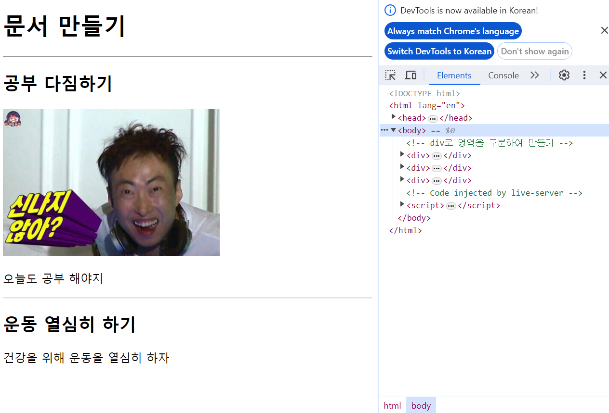

## 8장 컨테이너와 전역 속성



### 컨테이너 태그

* 콘텐츠나 레이아웃에 아무런 영향도 주지 않고, 단지 다른 요소 여럿을 묶어 관리하기 편하게 만드는 역할을 하는 태그를 컨테이너라고 합니다.

* 콘텐츠 내용을 구분하거나, 공통적인 스타일을 적용하고자 할 경우 개발자는 컨테이너를 사용하는 것이 좋습니다.

* div 와 span 태그는 컨테이너 역할을 담당하는 태그들이며 div 태그는 블록 레벨 컨테이너 span 태그는 인라인 컨테이너입니다.

---

### 전역 속성 (Global Attributes)

* 전역 속성은 모든 HTML 태그에서 공통으로 사용이 가능한 속성입니다.

* 속성이란 태그의 부가적인 기능을 정의하는 것으로 선택사항입니다. 속성은 시작 태그의 내부에 정의하며 속성은 개수에 특별한 제한이 없습니다.

---

### 대표적인 전역 속성들

* id : 요소에 고유한 이름을 부여하는 식별자 역할 속성입니다.

* class : 요소를 그룹 별로 묶을 수 있는 식별자 역할 속성입니다.

* style : 요소에 적용할 css 스타일을 선언하는 속성입니다.

* title : 요소에 추가 정보를 제공하는 텍스트 속성이며 사용자에게 툴팁을 제공합니다.

---

### 실습하기

```javascript
<!DOCTYPE html>
<html lang="en">
<head>
    <meta charset="UTF-8">
    <meta name="viewport" content="width=device-width, initial-scale=1.0">
    <title>영역을 구분해보자</title>
</head>
<body>
    <!-- div로 영역을 구분하여 만들기 -->
    <!-- id와 class로 각 요소들을 구분하여 코드를 작성할 수 있습니다. -->
    <div id="study1">
        <h1 class="main"><span>문서 만들기</span></h1>
        <hr />
    </div>
    
    <div id="study2">
        <h2 class="title">공부 다짐하기</h2>
        
        <p>오늘도 공부 해야지</p>
        <hr />
    </div>

    <div id="study3">
        <h2 class="title"><span>운동 열심히 하기</span></h2>
        <p>건강을 위해 운동을 열심히 하자</p>
    </div>
</body>
</html>
```


---

### 내용 정리

* 콘텐츠나 레이아웃에 영향을 주지 않는 태그 요소를 컨테이너라고 합니다.

* 컨테이너는 영역을 묶어서 관리하고자 할 경우 사용합니다.

* 모든 태그에 공통적으로 지정 가능한 속성을 전역 속성이라고 합니다.

* id와 class는 태그명이 같은 요소들을 식별하기 위해 사용하는 속성들입니다.

* id는 태그당 하나씩만 지정해야 하나, class는 여러 개를 지정할 수 있고 중복도 가능합니다.

* 특정 태그에만 지정이 가능한 속성들도 물론 존재합니다.